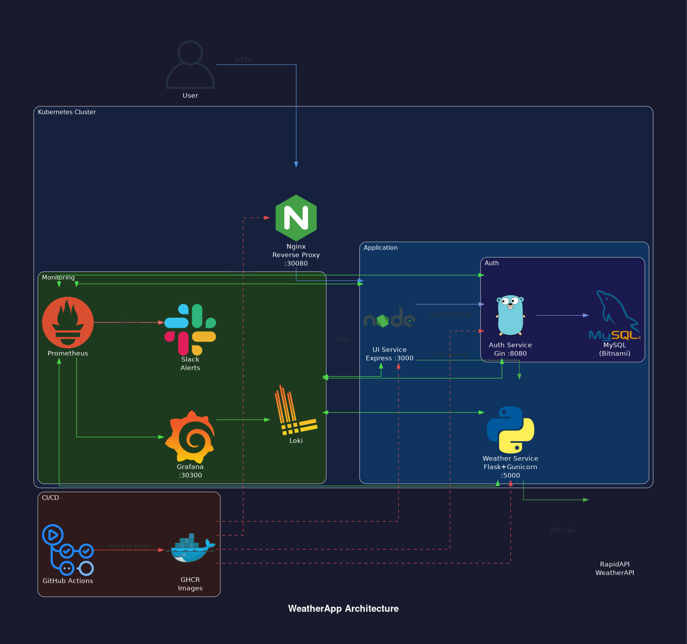

# WeatherApp

> A practice  microservices weather application deployed on Kubernetes with full observability, security hardening, and automated CI/CD.


---

## Tech Stack

### Application


### Infrastructure & Deployment


### Observability


### CI/CD & Security


---

## Architecture



---

## Services

| Service | Language | Framework | Port | Image |
|---------|----------|-----------|------|-------|
| **nginx** | — | Nginx 1.27 | 30080 | `ghcr.io/zakaria-bouhdima/weatherapp-nginx` |
| **ui** | Node.js 20 | Express | 3000 | `ghcr.io/zakaria-bouhdima/weatherapp-ui` |
| **auth** | Go 1.21 | Gin | 8080 | `ghcr.io/zakaria-bouhdima/weatherapp-auth` |
| **weather** | Python 3.13 | Flask + Gunicorn | 5000 | `ghcr.io/zakaria-bouhdima/weatherapp-weather` |

---

## Features

### Microservices
- **UI** — Node.js/Express frontend with JWT cookie authentication, served via Nginx reverse proxy
- **Auth** — Go/Gin REST API handling user registration and login, passwords hashed with bcrypt, tokens signed with HS256 JWT, backed by MySQL
- **Weather** — Python/Flask service proxying [WeatherAPI](https://www.weatherapi.com/) via RapidAPI, served by Gunicorn with 10s request timeout

### Kubernetes & Helm
- Each service packaged as an independent **Helm chart** with configurable replicas, resources, and image tags
- MySQL deployed as a Helm dependency inside the auth chart
- Secrets managed via a Kubernetes `Secret` (`weatherapp-secrets`) — never stored in values files
- Liveness and readiness probes on each service's health endpoint
- **HPA** (Horizontal Pod Autoscaler) available for all services

### Reverse Proxy — Nginx
- Single entry point for all traffic on `NodePort :30080`
- Upstream routing to the UI service
- Security headers: `X-Content-Type-Options`, `X-Frame-Options`, `X-XSS-Protection`, `Referrer-Policy`
- `server_tokens off` — hides Nginx version
- Gzip compression for text, CSS, JSON, JS
- Internal `stub_status` metrics endpoint on port 8080 (localhost only)

### Observability Stack
- **Prometheus** — scrapes metrics from all services (Flask `/metrics`, Gin `/metrics`, Node.js `/metrics`)
- **Grafana** — pre-built WeatherApp dashboard with 4 sections:
  - Traffic: request rate by status code per service
  - Error rate: 5xx rate vs SLO threshold (0.5%)
  - Latency: p50 / p95 / p99 per service
  - Kubernetes health: pod restarts, deployment availability
- **Loki + Promtail** — log aggregation from all pods with relabeling by `app`, `namespace`, `pod`
- **Alertmanager** — routes `critical` alerts to Slack

### SLOs

| Metric | Target |
|--------|--------|
| Error rate (5xx) | < 0.5% |
| p95 latency | < 500ms |

### Alert Rules

| Alert | Condition | Severity |
|-------|-----------|----------|
| `WeatherServiceHighErrorRate` | 5xx rate > 0.5% for 5m | critical |
| `AuthServiceHighErrorRate` | 5xx rate > 0.5% for 5m | critical |
| `WeatherServiceHighLatency` | p95 > 500ms for 5m | warning |
| `AuthServiceHighLatency` | p95 > 500ms for 5m | warning |
| `PodCrashLooping` | > 3 restarts in 15m | critical |
| `PodNotReady` | pod not ready for 5m | warning |
| `DeploymentReplicasMismatch` | desired ≠ available for 5m | warning |
| `NginxDown` | nginx_up == 0 for 1m | critical |

### CI/CD — GitHub Actions

```
push to main
  ├── Build auth    → ghcr.io/zakaria-bouhdima/weatherapp-auth:<sha>
  ├── Build UI      → ghcr.io/zakaria-bouhdima/weatherapp-ui:<sha>
  ├── Build weather → ghcr.io/zakaria-bouhdima/weatherapp-weather:<sha>
  ├── Build nginx   → ghcr.io/zakaria-bouhdima/weatherapp-nginx:<sha>
  └── Trivy scan    → fails on CRITICAL/HIGH unfixed CVEs
```

### Security Hardening
- All pods run as **non-root** (`runAsUser: 1000`, `runAsNonRoot: true`)
- `allowPrivilegeEscalation: false` on all containers
- Linux capabilities dropped (`capabilities.drop: [ALL]`)
- Secrets injected via Kubernetes `secretKeyRef` — never in plaintext
- JWT secret shared between auth and UI via Kubernetes secret
- CORS restricted to known origins
- `golang-jwt/jwt/v4` replaces archived `dgrijalva/jwt-go` (CVE-2020-26160)

---

## Prerequisites

| Tool | Purpose |
|------|---------|
| [Docker](https://docs.docker.com/get-docker/) | Container runtime |
| [Kind](https://kind.sigs.k8s.io/) | Local Kubernetes cluster |
| [kubectl](https://kubernetes.io/docs/tasks/tools/) | Kubernetes CLI |
| [Helm](https://helm.sh/docs/intro/install/) | Package manager |
| [Make](https://www.gnu.org/software/make/) | Task runner |

---

## Quick Start

```bash
# 1. Create local Kind cluster (maps port 30080 → localhost:8080)
make cluster-up

# 2. Configure secrets
make secrets          # follow printed instructions

# 3. Deploy all services
make deploy

# 4. Deploy monitoring stack
make monitoring-install
```

App available at: **http://localhost:8080**
Grafana available at: **http://localhost:30300** — credentials: `admin` / `admin`

---

## Makefile Reference

| Target | Description |
|--------|-------------|
| `cluster-up` | Create Kind cluster |
| `cluster-down` | Delete Kind cluster |
| `secrets` | Print secrets setup instructions |
| `deploy` | Install / upgrade all app Helm charts |
| `destroy` | Uninstall all app Helm charts |
| `monitoring-install` | Deploy Prometheus, Grafana, Loki |
| `monitoring-destroy` | Teardown monitoring stack |

---

## Local Development — Arch Linux

Install all required tools:

```bash
# Docker
sudo pacman -S docker
sudo systemctl enable --now docker
sudo usermod -aG docker $USER   # log out and back in after this

# kubectl & Helm & Make
sudo pacman -S kubectl helm make

# Kind (AUR)
yay -S kind
# or manually:
# curl -Lo ./kind https://kind.sigs.k8s.io/dl/v0.22.0/kind-linux-amd64
# chmod +x ./kind && sudo mv ./kind /usr/local/bin/kind
```

Get your API key:

1. Go to [rapidapi.com](https://rapidapi.com) → search **WeatherAPI** → subscribe to the free plan → copy your key
2. Generate a JWT secret: `openssl rand -hex 32`

Then:

```bash
cp k8s/secrets.yaml.example k8s/secrets.yaml
# fill in jwt-secret and apikey
kubectl apply -f k8s/secrets.yaml

make cluster-up
make deploy
make monitoring-install   # optional
```

App: **http://localhost:8080** — Grafana: **http://localhost:30300**

---

## Secrets Setup

```bash
cp k8s/secrets.yaml.example k8s/secrets.yaml
# edit k8s/secrets.yaml — fill in:
#   jwt-secret: <strong random string>
#   apikey:     <your RapidAPI key from weatherapi.com>
kubectl apply -f k8s/secrets.yaml
```

> `k8s/secrets.yaml` and `.env` are in `.gitignore` — never committed.
